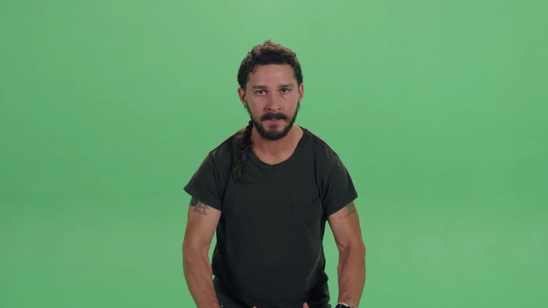
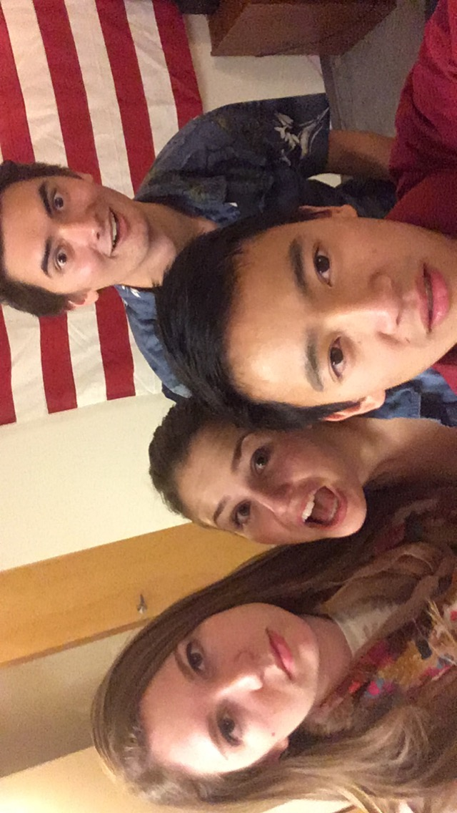

# Green Screen Processor for Shia LaBeouf
## What It Does
Take this image of Shia LaBeouf with a green screen behind him.  

## How It Works

## Next Steps
Notice the green outline of our hero, Shia LaBeouf, in the final image.  
Fine tuning the chroma key algorithm to detect a greater range of greens could result in a cleaner image.  

## Libraries Used
`os` for writing our RGB values to find threshold in foreground image.  
`pillow` or _Python Image Library_ to manipulate images on a pixel level.  

[rgb]https://www.w3schools.com/colors/colors_rgb.asp