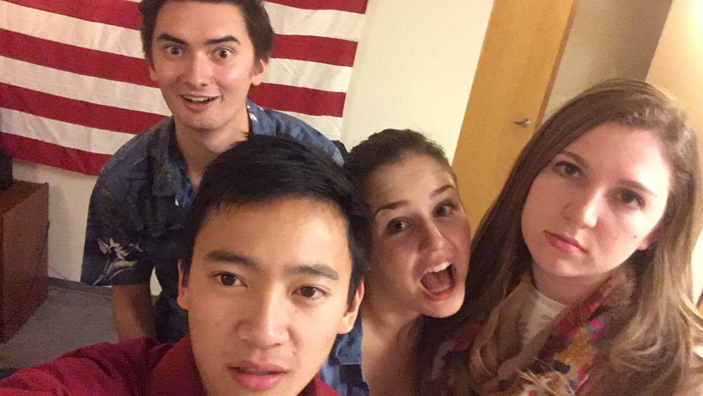
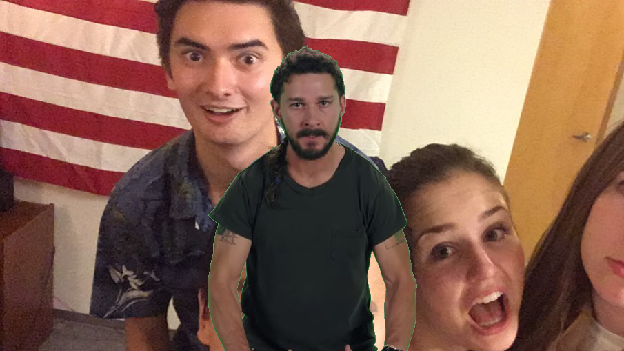

# Green Screen Processor for Shia LaBeouf

Take this image of Shia LaBeouf with a green screen behind him from the famous meme where Shia stands in front of a green screen giving a strangely effective motovational speech.  

If you haven't seen it, [check it out][shia].  You'll be glad you did.  

Superimpose Shia on the below image of me and friends.  

## How It Works
1) Import `pillow` library or _Python Image Library_ must be used to manipulate images on a pixel level.

2) Each pixel of the image containing the green screen is parsed and compares [RGB value][rgb] with a threshold in order to determine the 'greenness' of the pixel.  

3) Once the 'greenness' of the pixel is determined to be a green screen element, replace the pixel with a corresponding pixel from the background image.  

4) After this is repeated for all pixels (Shia LaBeouf image is `509x905`, which means 460,645 pixels), save the image as a standalone. 

5) The threshold is the heart of the algorithm, therefore outputing the RGB values for each pixel from the Shia LaBeouf image into a CSV could provide insight to an improved algorithm.   

6) Voila, we have our final product.  

> *"Don't let your dreams be dreams!"*
> Shia LaBeouf

## Next Steps
Notice a green outline on our hero, Shia LaBeouf, in the final image.  
Fine tuning the chroma key algorithm to detect a greater range of greens could result in a cleaner image.  

## Libraries Used
`os` for writing our RGB values to find threshold in foreground image.  
`pillow` or _Python Image Library_ to manipulate images on a pixel level.  

[shia]: https://www.youtube.com/watch?v=ZXsQAXx_ao0
[rgb]: https://www.w3schools.com/colors/colors_rgb.asp
